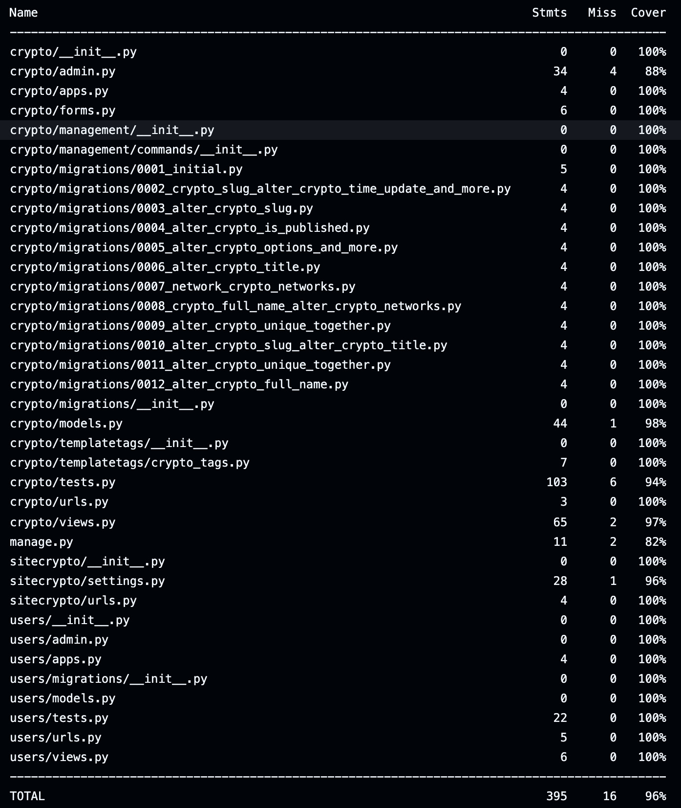

[](https://github.com/ieasycat/sitecrypto/actions/workflows/ci.yaml)

# SiteCrypto

SiteCrypto is a web application that provides information about some of the most famous cryptocurrencies, such as USDT, 
BTC (Bitcoin), ETH (Ethereum), Dogecoin, TON, and many others. For each coin, you can find the short and full name, 
history, and information about supported networks.

## Features

- **Coin Information**: View short and full names, history, and supported networks for each coin.
- **Network Filtering**: Select a specific network, like ERC-20, to view a list of all coins that support that network.
- **Coin Search**: Search for coins by short or full name through the built-in search feature.

## Key Technologies

- **Programming Language**: Python 3.12
- **Framework**: Django 4.2
- **Database**: PostgreSQL
- **Web Server**: Nginx (handles static files and routes requests on port 80)
- **Containerization**: Docker, Docker Compose
- **CI/CD**: GitHub Actions (code checks, testing, deployment to AWS EC2)

## Installation and Setup

### 1. Clone the Repository

```bash
git clone https://github.com/ieasycat/sitecrypto.git
```

### 2. Environment Setup

Create `.env` and `.env_docker` files based on `.env_example` and `.env_docker_example`, and fill in the necessary 
environment variables.

### 3. Create a Virtual Environment and Install Dependencies

Navigate to the project directory:

```bash
cd sitecrypto
```

Create a virtual environment and upgrade pip:

```bash
python -m venv .venv
pip install --upgrade pip
```

**For Linux/macOS:**

```bash
source .venv/bin/activate
```

**For Windows:**

```bash
.venv\Scripts\activate
```

Install dependencies:

```bash
pip install -r requirements.txt
```

### 4. Apply Migrations, Initialize Data and Create a Collection of Statistical Files

Apply migrations to set up the database:

```bash
python manage.py makemigrations
python manage.py migrate
```

Populate the database with initial data using the script:

```bash
./run_scripts.sh
```

Collect all the static in a single folder:

```bash
python manage.py collectstatic --no-input
```

### 5. Run the Application

Run the application locally:

```bash
python manage.py runserver
```

### 6. Run with Docker Compose

If you prefer using Docker, start the services with:

```bash
docker-compose up -d --build
```

This will start:

- **Django application** on port 8000
- **PostgreSQL** database
- **Nginx** for handling static files and proxying requests to port 80

### 7. Create a Superuser

To access the admin panel, create a superuser:

For the local environment:

```bash
python manage.py createsuperuser
```

For Docker Compose:

```bash
docker-compose exec web python manage.py createsuperuser
```

### 8. Run Tests

To ensure everything is working correctly, run the tests with coverage:

```bash
coverage run manage.py test
```

Generate a coverage report:

```bash
coverage report
```



## CI/CD

The project is configured to use CI/CD with GitHub Actions:

1. **Code and Test Checks**: Every change is checked for code style and successful test execution.
2. **Deployment**: Upon successful tests and checks, the project is automatically deployed to AWS EC2.

## Project Structure

- **`.github/`**: Contains GitHub Actions workflows for CI/CD.
  - **`workflows/`**: CI/CD configuration files.

- **`crypto/`**: Main application directory.
  - **`admin.py`**: Django admin configuration.
  - **`apps.py`**: Application-specific settings.
  - **`forms.py`**: Form definitions.
  - **`models.py`**: Database models.
  - **`tests.py`**: Test cases for the application.
  - **`urls.py`**: URL routing configuration.
  - **`views.py`**: View functions for handling requests.
  - **`data/`**: Contains data files for initial population.
  - **`management/`**: Custom management commands.
    - **`commands/`**: Contains scripts for custom management commands.
  - **`migrations/`**: Django database migrations.
  - **`static/`**: Static files directory.
    - **`crypto/`**: Static files specific to the `crypto` app.
      - **`css/`**: Stylesheets.
      - **`fonts/`**: Font files.
      - **`images/`**: Image files.
      - **`js/`**: JavaScript files.
  - **`templates/`**: HTML templates.
    - **`crypto/`**: Templates specific to the `crypto` app.
      - **`about.html`**: About page template.
      - **`add_page.html`**: Add page template.
      - **`contact.html`**: Contact page template.
      - **`delete_page.html`**: Delete page template.
      - **`add_date_page.html`**: Add date page template.
      - **`index.html`**: Index page template.
      - **`list_networks.html`**: List networks page template.
      - **`post.html`**: Post page template.
    - **`template_tags/`**: Custom template tags.
      - **`crypto_tags.py`**: Custom template tags for `crypto`.

- **`nginx/`**: Nginx configuration.
  - **`nginx.conf`**: Nginx configuration file.

- **`sitecrypto/`**: Project configuration.
  - **`asgi.py`**: ASGI configuration.
  - **`settings.py`**: Django settings.
  - **`urls.py`**: Project-level URL routing.
  - **`wsgi.py`**: WSGI configuration.

- **`templates/`**: Project-wide templates.
  - **`base.html`**: Base template for the project.
  - **`404.html`**: 404 error page template.

- **`users/`**: User management application.
  - **`admin.py`**: Admin configuration for users.
  - **`apps.py`**: Application-specific settings.
  - **`models.py`**: User-related models.
  - **`tests.py`**: Test cases for the `users` app.
  - **`urls.py`**: URL routing for the `users` app.
  - **`views.py`**: Views for user management.
  - **`migrations/`**: Django migrations for users.
  - **`templates/`**: User management templates.
    - **`users/`**: Templates specific to `users`.
      - **`login.html`**: Login page template.

- **`.gitignore`**: Specifies files and directories to be ignored by Git.
- **`.dockerignore`**: Specifies files and directories to be ignored by Docker.
- **`.flake8`**: Flake8 linter configuration.
- **`.pre-commit-config.yml`**: Pre-commit hooks configuration.
- **`boot.sh`**: Script for running migrations and starting the Gunicorn server in the container.
- **`docker-compose.yml`**: Docker Compose configuration for running all necessary services.
- **`Dockerfile`**: Docker image description for the Django application.
- **`manage.py`**: Django management script for running commands like migrations and tests.
- **`README.md`**: Project documentation.
- **`requirements.txt`**: List of Python dependencies.
- **`run_scripts.sh`**: Script for populating the database with initial data.

## Contacts

If you have any questions or suggestions, please contact us through GitHub Issues.

## License

The project is licensed under the MIT License. This is a permissive license that allows using, copying, modifying, 
and distributing the software. For details, see the `LICENSE` file.
